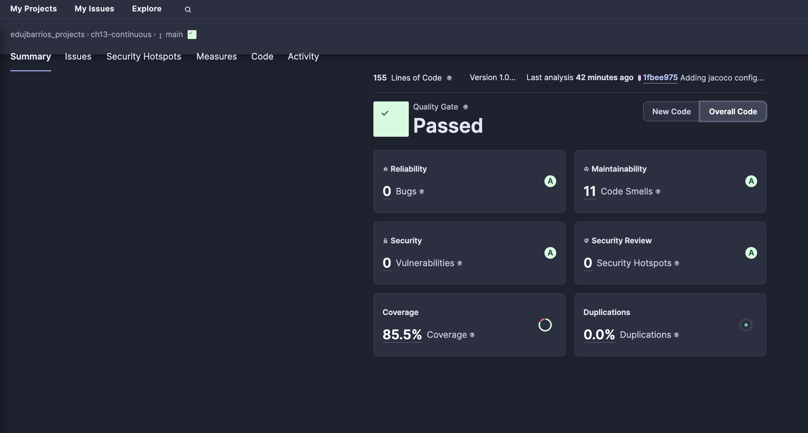

# AirportFlightManager

This project is mainly based in emulating the workfow of an airline management of flights and passengers plus adding some tests

## Sonarcloud Checks

## CircleCI Checks

- Check "Actions" section for more info about:
1. SonarCloud analysis
2. CircleCI integration analysis
3. Tests on Mac, windows and linux devices

- You can see a full report of sonarcloud section below:

